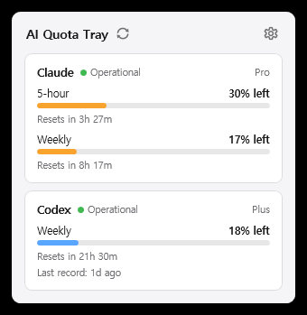
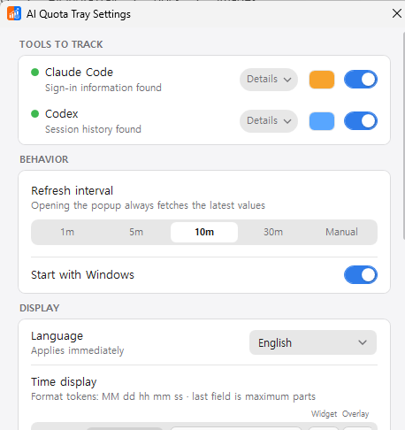

# AI Quota Tray

See how much of your Claude Code and Codex quota is left — right from the Windows tray.


This is not a token counter. It shows the **actual limits the servers report** and
when they reset.

<p align="center">
  
</p>

<p align="center">
  
</p>

## Download

**[`AI-Quota-Tray-Setup.exe`](https://github.com/1000Pro-1997/AI-Quota-Tray/releases/latest/download/AI-Quota-Tray-Setup.exe)** — about 2 MB.

That is all you need. It installs the app, starts it with Windows, and keeps it
up to date on its own. Nothing else to install — not even .NET.

<details>
<summary>Other files on the release page (you can ignore these)</summary>

The release also carries the app itself. The launcher downloads
`AiQuotaTray-standalone.exe` for you, so you only need these if you want to skip
the launcher and manage updates by hand.

| File | Size | Requires | Updates |
|---|---|---|---|
| `AiQuotaTray-standalone.exe` | About 157 MB | Nothing | Manual |
| `AiQuotaTray.exe` | 550 KB | [.NET 10 Desktop Runtime](https://dotnet.microsoft.com/download/dotnet/10.0) | Manual |

</details>

The launcher installs the app under `%LOCALAPPDATA%\AI Quota Tray`, so it works on
a clean Windows PC without installing .NET. On each launch it applies an update
already downloaded, starts the app immediately, then checks GitHub in the
background. If the network is unavailable, the installed version still starts.

## What it shows

| Tool | Limits |
|---|---|
| **Claude** | 5-hour session limit, weekly limit, and when each resets |
| **Codex** | Weekly limit, reset time, and plan |

Numbers default to what is **left** (`18% left`). Switch to what was **used**
(`82% used`) in Settings. Bar colors tell the tools apart — orange for Claude,
blue for Codex, both changeable.

## Where the data comes from

| Tool | Method | Network |
|---|---|---|
| Claude | Reads the OAuth token from `~/.claude/.credentials.json`, then calls the official usage endpoint | Yes |
| Codex | Parses `rate_limits` already recorded in `~/.codex/sessions/**/*.jsonl` | No |

**No API key needed.** If you are signed in to either CLI, the app finds it.

### How tokens are handled

The Claude credentials file is **read, never written**. Access tokens expire after
a few hours, but Claude Code refreshes them and writes them back — this app just
reads the file again. So it can never log you out.

If you have not run Claude Code in a while and the token has expired, you will see
"Waiting for token refresh". Running Claude Code once fixes it.

Usage lookups are read-only, so **they do not consume any of your quota**.

### Privacy

- **Never reads your conversations or prompts.** In Codex session logs it looks
  only for usage entries (`token_count`).
- Nothing is collected or sent anywhere. Requests go only to each service's own
  official endpoint.
- Tokens stay in memory and are never written down.
- The only things stored are your settings and the last known numbers, kept in
  `%APPDATA%\AiQuotaTray\`.

## Where it appears

### Tray icon

A colored square with a number — orange for Claude, blue for Codex. The number
follows your display setting (remaining by default).

With both tools enabled it alternates every 4 seconds. With one, it stays put.

Windows draws tray icons in a fixed 16×16 square, so it cannot be made wider.
Use the widget bar below for more room.

### Widget bar

An overlay that sits next to the notification area, one row per limit:

```
[====38%====     3h 39m ]   <- Claude 5-hour (orange)
[==18%==         8h 29m ]   <- Claude weekly
                             [=18%=   21h 41m ]   <- Codex weekly (blue)
```

Rows have fixed slots — session on top, weekly below. If a tool has no session
limit, that slot stays empty, so weekly always lines up.

The filled width matches the number: showing what is left fills by what is left.
Click the bar to open the popup. Hover to see which tool and which limit.

Remaining time recalculates every 30 seconds, independent of the refresh interval.

### Popup

Click the tray icon or the widget bar. Shows every limit in detail, along with each
service's status.

Click again to close, or click anywhere else. Refresh sits next to the title,
Settings is the gear at the top right. Quit lives in the tray icon's right-click
menu.

## Settings

<p align="center">
  
</p>

Changes apply the moment you make them — there is no Save button. **AllReset**
returns everything to defaults.

The current version sits at the bottom. The app checks GitHub Releases once a day.

Installations made through `AI-Quota-Tray-Setup.exe` update in place: the button
downloads the new build with a progress bar, verifies its SHA256, and turns into
**Restart to apply**. Pressing it hands over to the launcher, which waits for the
app to close, swaps the executable, and starts the new version — no reboot needed.
Portable/manual installations have no launcher to do the swap, so they link to the
release page instead.

Stored in `%APPDATA%\AiQuotaTray\settings.json`.

On first run the app enables only the tools it can actually find, and picks your
Windows display language.

## Language

Ten languages, switchable at any time (applies instantly):

English · 한국어 · 日本語 · 简体中文 · 繁體中文 · Español · Português ·
Deutsch · Français · Русский

To fix a translation or add a language, edit the table in `Services/Strings.cs`.
Missing entries fall back to English, so partial translations are fine.

## Always show on the taskbar

Windows 11 tucks new tray icons into the hidden overflow (`^`). Turn on
**Always show on taskbar** in Settings to pull it out. It is on by default.

It works by finding this app's entry under `HKCU\Control Panel\NotifyIconSettings`
and setting `IsPromoted` to 1. The key name is a hash of the executable path, so
the app matches on `ExecutablePath` instead — which means it works no matter where
you install it.

Windows creates that entry only after Explorer has seen the tray icon, and it
decides when. So the app watches for it and applies the setting once it appears
(every 2 seconds for the first 30, then every minute).

Settings reflects the actual registry state, not a saved value.

## Refresh and rate limits

The Claude usage endpoint is rate limited. To stay under it:

- If the last check was under 60 seconds ago, no new request is made — opening the
  popup repeatedly is safe
- On a 429 it backs off for as long as the server asks (2 minutes if unspecified)
- When a lookup fails it keeps showing the last good numbers and notes why it could
  not refresh
- Good values are saved to `last-usage.json`, so numbers survive a restart even if
  the server is unreachable (up to 12 hours)

Only the **Refresh** button bypasses the 60-second cache — and even it stays quiet
while a 429 backoff is active.

### Keep 5-hour windows aligned

The optional **Keep 5-hour windows aligned** setting sends one minimal, tool-free
request just after a Claude or Codex 5-hour window resets. This starts the next
5-hour window immediately instead of waiting for your next manual message. It also
creates a Windows wake task for each enabled provider, so sleeping or hibernating
PCs can wake at the scheduled time. It is off by default because each request
consumes a small amount of quota.

Weekly limits are not primed: Claude's weekly reset is fixed for the account and
does not depend on when you first use it. If the PC sleeps through a scheduled
time, the app skips that request rather than shifting the window late, then waits
for the next point on the original 5-hour schedule.

Wake timers must be allowed by Windows power settings and supported by the PC
firmware. A fully shut-down PC cannot be woken. Turning the option off removes the
scheduled wake tasks.

## Service status

Each tool's name carries a dot and a word from its public status page.

| Shown | Meaning | Color |
|---|---|---|
| Operational | No problems | Green |
| Degraded | Working but slow or unstable | Orange |
| Partial outage | Some features down | Dark orange |
| Outage | Down | Red |
| Maintenance | Planned work | Blue |

- Claude: https://status.claude.com (Claude Code, Claude API components)
- Codex: https://status.openai.com (Codex in ChatGPT Desktop, Responses, API)

It watches only the components this app actually depends on, and reports the worst
of them.

In the widget bar, trouble turns the usage number red (the time stays normal).
Degraded blinks instead of holding red, since the service still works.

Status is checked every 5 minutes, separately from usage. If it cannot be read,
usage still shows.

## Requirements

- Windows 11 (works on Windows 10, but taskbar pinning is Win11-only)
- [.NET 10 SDK](https://dotnet.microsoft.com/download) to build
- Rust toolchain to build the native launcher
- Signed in to Claude Code or Codex CLI

## Build and run

```
cd src/AiUsageTray
dotnet run
```

Single-file build:

```
dotnet publish -c Release
```

Build all three release files:

```powershell
.\build-release.ps1
```

### Command-line flags

- `--flyout` — open the popup right away, skipping the tray. Handy for debugging.

## Notes

Gemini CLI is not supported. Its session logs record neither token usage nor
limits, so there is nothing to show.

## Contributing

Bug reports and ideas are welcome in
[Issues](https://github.com/1000Pro-1997/AI-Quota-Tray/issues). You can also open
it straight from the app — the button at the bottom of Settings, or the tray
icon's right-click menu.

## License

MIT
