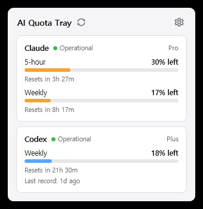
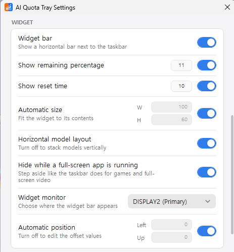
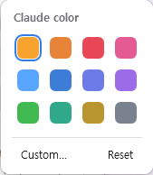
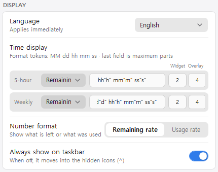

# AI Quota Tray

See how much of your Claude Code and Codex quota is left — right from the Windows tray.


This is not a token counter. It shows the **actual limits the servers report** and
when they reset.

<p align="center">
  
</p>

## Download

**[`AI-Quota-Tray.exe`](https://github.com/1000Pro-1997/AI-Quota-Tray/releases/latest/download/AI-Quota-Tray.exe)** — about 2 MB.

That is all you need. It installs the app, starts it with Windows, and keeps it
up to date on its own. Nothing else to install — not even .NET.

<details>
<summary>Other files on the release page (you can ignore these)</summary>

The release also carries the app itself. The launcher downloads
`AiQuotaTray-standalone.exe` for you, so you only need it if you want to skip
the launcher and manage updates by hand.

| File | Size | Requires | Updates |
|---|---|---|---|
| `AiQuotaTray-standalone.exe` | About 75 MB | Nothing | Manual |

</details>

The launcher installs the app under `%LOCALAPPDATA%\AI Quota Tray`, so it works on
a clean Windows PC without installing .NET. On each launch it applies an update
already downloaded, starts the app immediately, then checks GitHub in the
background. If the network is unavailable, the installed version still starts.

## What it shows

| Tool | Limits |
|---|---|
| **Claude** | 5-hour session limit, weekly limit, and when each resets |
| **Codex** | 5-hour and weekly limits, reset times, and plan |

Numbers default to what is **left** (`18% left`). Switch to what was **used**
(`82% used`) in Settings. Bar colors tell the tools apart — orange for Claude,
blue for Codex, both changeable.

If your ChatGPT account has **Codex limit reset credits**, the Codex card lists
them with their expiry date and how long is left (`Expires 10/23 · 17d 9h left`).
The expiry turns yellow within a week and red within 3 days. **Use reset** asks
for a second click to confirm, then spends the credit. Settings → Tools → Codex
details can hide the list, the date, the time left, or the colors (all shown by
default).

## Where the data comes from

| Tool | Method | Network |
|---|---|---|
| Claude | Reads the OAuth token from `~/.claude/.credentials.json`, then calls the official usage endpoint | Yes |
| Codex | Calls the same usage endpoint the ChatGPT web page uses, signed in with your Codex token. Falls back to `rate_limits` recorded in `~/.codex/sessions/**/*.jsonl` if the server cannot be reached | Yes |

**No API key needed.** If you are signed in to either CLI, the app finds it.

Because Codex numbers come from the server, usage from the web, other PCs, or a
Mac is included — not just what this PC ran. If a session-log entry is older than
its reset time, that window is shown as reset instead of a stale percentage.

Claude also reports your limits to its own status line every time you use it. The
app picks those up as a second source, so numbers can stay fresh even when the
usage endpoint is unreachable. To receive them it registers a small helper script
as Claude Code's `statusLine` in `~/.claude/settings.json` — **only if you have not
set one yourself.** An existing status line is never overwritten.

### How tokens are handled

The Claude credentials file is **read, never written**. Access tokens expire after
a few hours, but Claude Code refreshes them and writes them back — this app just
reads the file again. So it can never log you out.

If you have not run Claude Code in a while and the token has expired, you will see
"Waiting for token refresh". Running Claude Code once fixes it.

For Codex the app picks a token in this order:

1. `~/.codex/auth.json`, if it has not expired.
2. The Codex sign-in kept by omp (`~/.omp/agent/agent.db`), read-only. Useful if
   you use Codex models through omp instead of the Codex CLI.
3. **Renew expired Codex sign-in** (Settings → Codex, on by default): the app
   renews `auth.json` the same way the Codex CLI does and writes it back. The Codex
   CLI only renews when it runs, so if you mostly use Codex elsewhere the token
   would otherwise stay expired. Before writing, the app re-reads the file and backs
   off if the CLI renewed it first. Risk: if the CLI renews at exactly the same
   moment, one side may be signed out. Turn the option off to keep the file
   read-only.

If Claude Code is signed out, the flyout offers **Sign in**. The app starts
`claude auth login` in the background and opens that attempt's authorization URL
in your default browser. If the browser displays a code, reopen the flyout and
paste it into the code field; the login attempt ends after 10 minutes if unfinished.

Usage lookups are read-only, so **they do not consume any of your quota**.

### Privacy

- **Never reads your conversations or prompts.** In Codex session logs it looks
  only for usage entries (`token_count`).
- Nothing is collected or sent anywhere. Requests go only to each service's own
  official endpoint.
- Tokens are never sent anywhere but the service that issued them. The only file
  the app writes a token to is `~/.codex/auth.json`, and only when **Renew expired
  Codex sign-in** is on.
- The only things stored are your settings and the last known numbers, kept in
  `%APPDATA%\AiQuotaTray\`.

## Where it appears

### Tray icon

A colored square with a number — orange for Claude, blue for Codex. The number
follows your display setting (remaining by default).

<p align="center">
  
</p>

With both tools enabled it alternates every 4 seconds. With one, it stays put.

Hover over the icon to see everything without opening the popup: for each tool
its plan and service status, every limit with what is left (or used) and when it
resets, Codex token totals from the last session on this PC, and when it last
refreshed. Windows cuts its own tray tooltips at 127 characters, so the app draws
this one itself.

Windows draws tray icons in a fixed 16×16 square, so it cannot be made wider.
Use the widget bar below for more room.

### Widget bar

An overlay that sits next to the notification area, one row per limit:

<p align="center">
  
</p>

```
[====38%====     3h 39m ]   <- Claude 5-hour (orange)
[==18%==         8h 29m ]   <- Claude weekly
                             [=18%=   21h 41m ]   <- Codex weekly (blue)
```

Rows have fixed slots — session on top, weekly below. If a tool has no session
limit, that slot stays empty, so weekly always lines up.

The filled width matches the number: showing what is left fills by what is left.
Click the bar to open the popup. Hover to see which tool and which limit.

Remaining time recalculates every 30 seconds, independent of the refresh interval.

#### Fitting it to your taskbar

The bar sizes itself to its contents by default. Turn auto-size off to set width
and height by hand, and switch the layout so the two tools stack vertically instead
of sitting side by side.

<p align="center">
  
</p>

Percentages and reset times can each be hidden — leaving just the bars — and both
have their own font size. On a multi-monitor setup, **Widget monitor** picks which
display hosts the bar; the app places it next to that monitor's notification area.
If your taskbar layout is unusual, turn **Automatic position** off and nudge the bar
with the Left and Up offsets.

**Hide on full screen** is on by default: the bar gets out of the way when a game or
video goes full screen on the monitor it sits on, and comes back when you exit.

**Bring widget to front every** accepts a number of seconds, including decimals
(0.1–3600; 1 by default). It restores the bar above the taskbar without
stealing keyboard focus or changing the usage refresh interval. Full-screen
visibility is still checked every second, regardless of this setting.

#### Colors

Orange for Claude, blue for Codex — click the color chip next to either tool in
Settings to change it. Twelve presets cover most cases; **Custom** opens the Windows
color picker for anything else, and **Reset** puts the original color back.

<p align="center">
  
</p>

The presets avoid very light shades on purpose, since the percentage is drawn in
white on top of the filled bar.

### Popup

Click the tray icon or the widget bar. Shows every limit in detail, along with each
service's status.

Click again to close, or click anywhere else. Refresh sits next to the title,
Settings is the gear at the top right. Quit lives in the tray icon's right-click
menu.

## Time display

Every limit can show either **how long is left** (`3h 39m`) or **when it resets**
(`at 6:40 PM`). Session and weekly limits are set separately, so you can count down
the 5-hour window while reading the weekly one as a date.

<p align="center">
  
</p>

The format itself is a template you can edit — `dd"d" hh"h" mm"m" ss"s"` spells out
which units appear and how they are labelled. The two numbers beside it cap how many
units actually show: **Widget** for the bar, **Overlay** for the popup, so the bar
can stay terse (`2d 4h`) while the popup spells it out (`2d 4h 30m 15s`).

Showing seconds makes the display tick every second; otherwise it updates once a
minute. The countdown is recalculated locally, so it keeps moving between refreshes.

## Settings

Settings is split into four tabs — **Tools** (which tools to track and their
details), **Display**, **Widget**, and **General** (refresh interval, startup,
version and updates). Changes apply the moment you make them — there is no Save
button. **AllReset** returns everything to defaults.

The current version sits in the General tab. The app checks GitHub Releases each time it
starts, and again in the background every time you open the popup. The popup check
only peeks at the latest release tag, which does not count against GitHub's API
rate limit; the full release details are fetched only when the tag is newer. Once
a newer version is found, an **Update** button appears next to the settings gear in the popup and the app stops
asking. Pressing it updates right there — the button shows download progress,
then the app restarts into the new version. Settings does not open.
On multi-monitor systems, Settings also lets you choose which display hosts the
widget bar. A GitHub shortcut opens the project homepage directly.

Installations made through `AI-Quota-Tray.exe` update in place: the button
downloads the new build with a progress bar, verifies its SHA256, and turns into
**Restart to apply**. Pressing it hands over to the launcher, which waits for the
app to close, swaps the executable, and starts the new version — no reboot needed.
Portable/manual installations have no launcher to do the swap, so they link to the
release page instead.

Stored in `%APPDATA%\AiQuotaTray\settings.json`.

On first run the app enables only the tools it can actually find, and picks your
Windows display language.

## Language

Ten languages, switchable at any time (applies instantly):

English · 한국어 · 日本語 · 简体中文 · 繁體中文 · Español · Português ·
Deutsch · Français · Русский

To fix a translation or add a language, edit the table in `Services/Strings.cs`.
Missing entries fall back to English, so partial translations are fine.

## Always show on the taskbar

Windows 11 tucks new tray icons into the hidden overflow (`^`). Turn on
**Always show on taskbar** in Settings to pull it out. It is on by default.

It works by finding this app's entry under `HKCU\Control Panel\NotifyIconSettings`
and setting `IsPromoted` to 1. The key name is a hash of the executable path, so
the app matches on `ExecutablePath` instead — which means it works no matter where
you install it.

Windows creates that entry only after Explorer has seen the tray icon, and it
decides when. So the app watches for it and applies the setting once it appears
(every 2 seconds for the first 30, then every minute).

Settings reflects the actual registry state, not a saved value.

## Refresh and rate limits

The Claude usage endpoint is rate limited. To stay under it:

- If the last check was under 60 seconds ago, no new request is made — opening the
  popup repeatedly is safe
- On a 429 it backs off for as long as the server asks (2 minutes if unspecified)
- When a lookup fails it keeps showing the last good numbers and notes why it could
  not refresh
- Good values are saved to `last-usage.json`, so numbers survive a restart even if
  the server is unreachable (up to 12 hours)

Only the **Refresh** button bypasses the 60-second cache — and even it stays quiet
while a 429 backoff is active.

### Start quota windows after reset

Provider-specific settings can send one minimal, tool-free request just after a
Claude or Codex 5-hour or weekly window resets. This starts the selected next
window immediately instead of waiting for your next manual message. Each enabled
option creates its own Windows wake task, so sleeping or hibernating PCs can wake
at the scheduled time. All options are off by default because each request
consumes a small amount of quota.

The request is only `hi`: Claude uses Haiku at low effort; Codex uses
GPT-6 Luna with reasoning disabled. The app waits for the request to finish
before treating a new window as started.

Claude's weekly reset currently does not need a priming request, but the option is
available in case the policy changes. Codex's 5-hour option is also retained while
that limit is temporarily not applied. If the PC sleeps through a scheduled time,
the app skips that request rather than shifting the window late, then waits for
the next point on the original schedule.

Wake timers must be allowed by Windows power settings and supported by the PC
firmware. A fully shut-down PC cannot be woken. Turning the option off removes the
scheduled wake tasks.

## Service status

Each tool's name carries a dot and a word from its public status page.

| Shown | Meaning | Color |
|---|---|---|
| Operational | No problems | Green |
| Degraded | Working but slow or unstable | Orange |
| Partial outage | Some features down | Dark orange |
| Outage | Down | Red |
| Maintenance | Planned work | Blue |

- Claude: https://status.claude.com (Claude Code, Claude API components)
- Codex: https://status.openai.com (Codex in ChatGPT Desktop, Responses, API)

It watches only the components this app actually depends on, and reports the worst
of them.

In the widget bar, trouble turns the usage number red (the time stays normal).
Degraded blinks instead of holding red, since the service still works.

Status is checked every 5 minutes, separately from usage. If it cannot be read,
usage still shows.

## Requirements

- Windows 11 (works on Windows 10, but taskbar pinning is Win11-only)
- [.NET 10 SDK](https://dotnet.microsoft.com/download) to build
- Rust toolchain to build the native launcher
- Signed in to Claude Code or Codex (Codex CLI or omp)

## Build and run

```
cd src/AiUsageTray
dotnet run
```

Single-file build:

```
dotnet publish -c Release
```

Build all three release files:

```powershell
.\build-release.ps1
```

### Command-line flags

- `--flyout` — open the popup right away, skipping the tray. Handy for debugging.

## Notes

Gemini CLI is not supported. Its session logs record neither token usage nor
limits, so there is nothing to show.

## Contributing

Bug reports and ideas are welcome in
[Issues](https://github.com/1000Pro-1997/AI-Quota-Tray/issues). You can also open
it straight from the app — the button at the bottom of Settings, or the tray
icon's right-click menu.

## License

MIT
